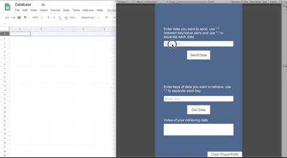

# Umbrella
A Unity asset using Google Sheets for storing and retrieving data. This package also provides two applications, **Database** and **Ranking**, to demostrate the usage. 

Database can let you send any form of data to Google sheets and retrieve them later. You can use this system to store player information, such as id, name, equipments, and even master data of your game systems. Data are sent by key value paris and are restricted to some simiple types that [MiniJson](https://gist.github.com/darktable/1411710) can parse.

Ranking is another application that can send player score to Google sheets and get the ranking list back.

Because this asset almost does nothing about security things (hope Google will handle it well though), as well as [Quotas for Google Services](https://developers.google.com/apps-script/guides/services/quotas#current_quotas), **it is not recommended for big scale or any commercial projects**. Indie developers who just want a simple way of saving and getting data online are welcome to try this :)

# How to use
## Google sheets side
1. Create a new Google sheet.
2. Open the Script Editor from Tools > Script Editor.
3. Copy the content of the .gs file (within the .unitypackage) to the Script Editor.
4. Save the project and give it a name.
5. From the menu, Publish < Deploy as web app...
6. In the Deploy as web app popup, make sure you Execute the app as your own account and **Who has access to the app** is set to *Anyone, even anonymous*.
7. Click Deploy and copy the web app URL.
## Unity side (Database)
1. Drag & Drop the *DatabaseManager* prefab into your scene hierarchy (the scene you want to do the data communication).
2. From the prefab instance, paste the web app URL you copied previously to the *App Url* field.
3. Enter the sheet name of your default sheet into the *Default Sheet* field.
4. You can now send any data to Google sheets using `DatabaseManager.Instance.SendDataAsync(data, handleResponseCallback, sheetName)` and get data from Google sheets use `DatabaseManager.Instance.GetDataAsync(key, handleResponseCallback, sheetName)`. You can also add `yield return` before these methods to wait until the *handleResponseCallback* returns.
5. For specific usage, please refer to the sample scene and scripts.
## Unity side (Ranking)
1. Drag & Drop the *RankingManager* prefab into your scene hierarchy (the scene you want to do the data communication).
2. In the *RankingSettings* scriptableobject asset, paste the web app URL you copied previously to the *App Url* field.
3. You can set different kinds of rankings by adding entries to the *Ranking Request Settings* array. *Ranking Name* refers to the name of the ranking, *Ranking Number* tells how many rows you want to get (e.g., ranking number of 3 will get you only the first three places of the ranking list), and *Order By* allows you to choose from ascending (ASC) or descending (DESC) order.
4. You can now send score to Google sheets using `RankingManager.Instance.SendScoreAsync(playerName, score, handleResponseCallback, rankingRequestIndex)` and get the ranking list from Google sheets using `RankingManager.Instance.GetRankingListAsync(handleResponseCallback, rankingRequestIndex)`. If you want, add `yield return` before these methods to hang on and wait until the *handleResponseCallback* returns.
5. For specific usage, please refer to the sample scene and scripts.

# Demo
## Database
* Send data to Google sheets.

* Update data in Google sheets.

* Send another data. Note: Because Umbrella generates unique ids in Unity and saves them in PlayerPrefs, you should clear PlayerPrefs otherwise duplicated sending will overwrite the data already stored in Google sheets.

* Get data from Google sheets by keys.

* You can also get data by cell references.

## Ranking
* Send scores to Google sheets.

* Update score in Google sheets.

* Get ranking list from Google sheets.

